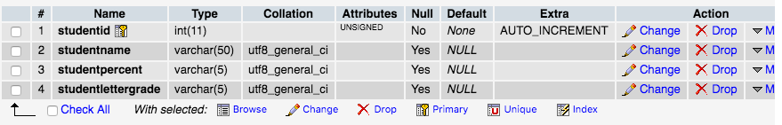

# PHP-MVC-CRUD 
Cordell Radke - WD6-LAMP-QUIZ

# Video Demo

* [Full PHP MVC CRUD DEMO](https://www.youtube.com/watch?v=1Rit8vXA4t8&feature=youtu.be)

#  Student Grades Report

This is a simple grade calculator app that allows teachers to plugin a grade percentage such as (80) and the calculator will report back the letter grade which in this case would be a (B). This app stores all of the student data in mySQL databases and also will display the student's name and id. You are also able to delete and edit students that need to be updated. Enjoy! :)


## Technologies Used

* [PHP](http://www.php.net/): ^7.1.16,
* [MAMP](https://www.mamp.info/en/), 
* [MYSQL](https://www.mysql.com/)


# Project Setup

## How to Setup

**Step 1:** git clone this repo

**Step 2:** cd to the cloned repo

**Step 3:** Install Technologies

**Step 4:** Go to htdocs folders applications/MAMP/htdocs 

**Step 5:** Copy and paste cloned repo into htdocs folder

## How to Run App

### Run Build using MAMP
   
1. Open MAMP application
2. Start Servers
3. Make sure you check Apache and MySQL server
4. Typically, you will want to go to something like Localhost:8888, but it will depend on network configurations


## Make a Database and Table

1. Once MAMP is running, travel to phpMyAdmin by looking at MAMP's Preferences and Apache Port
2. Create a Name for your Database called grades
3. Create a Name for your Table called grades
4. Structure should look like this...





## If you need to change DB settings go to the Model.php file

1. Change db connection to your desired settings
2. For example, usually your username and pass will be 'root'
3. Your 'mysql:host' should typically be equal to 'localhost' 

```
 $db = new pdo('mysql:host=localhost;dbname=grades','root','root');

```
